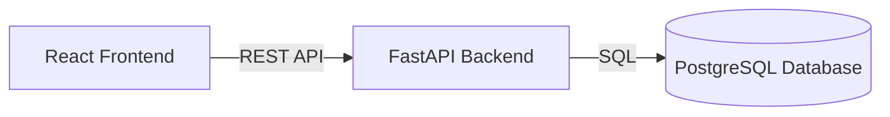

# Smart Expense Tracker

A full-stack web application for tracking personal income and expenses,
organising transactions into categories, and visualising spending patterns.

## Tech Stack

- React
- FastAPI
- PostgreSQL
- Python
- JavaScript

## Features

- Add expenses
- Add income
- Categorise transactions
- View transaction history
- View spending statistics

## Architecture

## Testing

## Future Improvements

- User authentication
- Budget limits
- Deployment
- Docker
