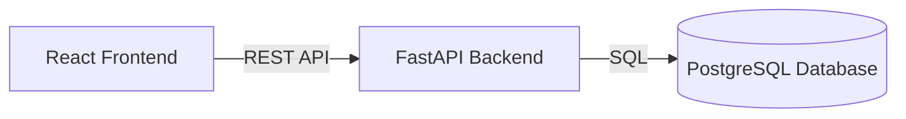

# Smart Expense Tracker

A full-stack web application for tracking personal income and expenses,
organising transactions into categories, and visualising spending patterns.

## Tech Stack

- React
- FastAPI
- PostgreSQL
- Python
- JavaScript

## Features

- Add expenses
- Add income
- Categorise transactions
- View transaction history
- View spending statistics

## Architecture


## Backend Setup

### 1. Create a virtual environment

```bash
python -m venv .venv
```

### 2. Activate the virtual environment

On Windows:

```bash
.venv\Scripts\activate
```

### 3. Install dependencies

```bash
pip install -r requirements.txt
```

### 4. Run the backend

```bash
uvicorn backend.main:app --reload
```

The API will run at:

`http://127.0.0.1:8000`

### API Documentation

FastAPI automatically provides interactive API documentation at:

`http://127.0.0.1:8000/docs`

## Testing

## Future Improvements

- User authentication
- Budget limits
- Deployment
- Docker
